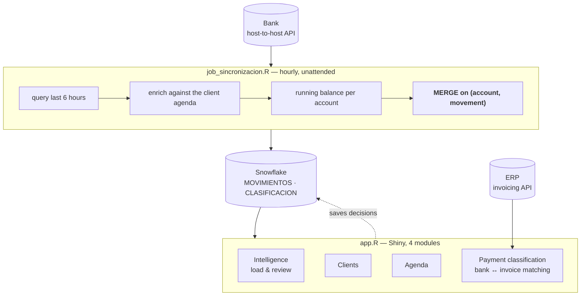

# Bank Reconciliation — Host-to-Host

> An hourly job that pulls the group's bank movements straight from the bank's
> host-to-host API, and a Shiny application that reconciles them against invoices
> and receivables. Six-figure monthly volumes that used to be matched by hand.
> Built at a real estate and media group in Mexico.
> **Anonymized portfolio version — all data is synthetic.**

  

---

## The problem

Finance downloaded a statement per account per month and matched deposits against
invoices by eye. Across dozens of accounts and several companies that is a week of
someone's month, and it is the kind of work where a mistake is invisible until a
client calls.

What makes bank reconciliation resist automation is not the volume, it is that the
bank's description field is free text written by whoever sent the money:

- Some payers put their **tax ID** in the reference. Most do not.
- One transfer often **settles several invoices**; one invoice is often **paid in
  instalments**.
- Deposits arrive from payers with **no invoice at all**.
- Half the movements are not collections — they are transfers, fees and taxes, and
  including them corrupts the match.

## What I built

Two pieces. An unattended job that keeps the warehouse current, and an application
where finance works on what the job could not decide on its own.

| | |
|---|---|
| **Stack** | R 4.5 · Shiny · Snowflake (JDBC, key-pair JWT) · `future`/`promises` |
| **Sources** | Bank host-to-host API · ERP invoicing API |
| **Cadence** | Hourly, 6-hour window, idempotent |
| **Outcome** | Manual review time cut sharply; the ledger is current within the hour |

---

## Architecture



---

## Design decisions

### The window overlaps on purpose, so the merge has to be idempotent

The job runs every hour but asks the bank for the **last six hours**. Overlap is
deliberate: a movement that posts late, or an hour the machine was down, still gets
picked up. The cost is that every row is offered about six times.

That only works because the write is a `MERGE` on `(account, movement number)`. Same
key and same content, nothing is written. Same key, different content — the bank does
amend descriptions — and only that row is updated. `scripts/run_demo.R` demonstrates
exactly this: second run writes 0 rows; amend 5 rows and it writes 5.

### The tax ID is extracted, and the failure is visible

`cp_extraer_rfc()` pulls the payer's tax ID out of the bank's free-text field with a
pattern that validates the shape, not just the presence of the letters "RFC". About
85% of collections carry one.

The other 15% matter more. They are not silently dropped or guessed at: they surface
in the app as unmatched, for a human to resolve. A reconciliation that quietly guesses
is worse than one that admits what it could not decide.

### Amount-driven matching, largest first

Payments are applied against the payer's outstanding invoices in descending order of
amount, drawing down each invoice's balance. That handles both directions of the
mismatch — one payment over several invoices, several payments against one invoice —
without needing a rule per case.

### The balance is recomputed, not trusted

The running balance per account is recalculated from the movement sequence rather than
taken from the API response, so a gap or an out-of-order page shows up as a
discrepancy instead of quietly corrupting the ledger.

### Long work does not freeze the screen

The Shiny app uses `future`/`promises` so pulling a month of movements or querying the
ERP does not block the session. On a single-process Shiny server, a synchronous call
here blocks every user, not just the one who clicked.

---

## Run the demo

No credentials, no bank, no ERP, no Snowflake.

```bash
git clone https://github.com/chino-bot1701/bank-reconciliation-h2h.git
cd bank-reconciliation-h2h
Rscript -e 'install.packages(c("dplyr","stringr","digest"))'
Rscript scripts/run_demo.R
```

```
1. Resolve company from account number
   OPERADORA REGIONAL DE INMUEBLES SA DE CV         23
   ...
2. Keep collections, drop outgoing movements
   98 movements -> 73 collections (25 outgoing dropped)
3. Extract payer tax ID from the description
   tax ID found in 63 of 73 (86%)
   the other 10 carry no tax ID and cannot be matched this way
4. Match payments to invoices
   grouped        27
   matched        28
   unmatched      18
   invoices fully settled: 36 of 60
5. Merge into the ledger, twice
   first run      98 insert     0 update     0 unchanged
   second run      0 insert     0 update    98 unchanged
   bank amends 5 rows      0 insert     5 update    93 unchanged

  [PASS]  re-running the same window wrote 0 rows (expected 0)
  [PASS]  after 5 amendments: 5 updated, 0 inserted (expected 5, 0)
```

Steps 1 and 3 call the production functions from `R/clasificacion_pagos.R`,
unchanged. Exit code is non-zero if any assertion fails.

### Against the real systems

```bash
cp .env.example .env     # fill in
Rscript -e 'shiny::runApp("R/app.R")'
```

The Shiny app needs Snowflake, the Java JDBC driver and a key-pair; it is here to be
read, not to be run by a visitor.

---

## Repository layout

```
R/app.R                     Shiny app: 4 modules, async via future/promises
R/banco_api.R               host-to-host client: signing, accounts, windows
R/clasificacion_pagos.R     bank ↔ invoice matching, tax ID extraction
R/movimientos.R             movement ingest and lookups
R/descarga_excel.R          statement export
R/estado_cuenta_banco2.R    second bank's statement format
R/job_sincronizacion.R      the hourly unattended job
demo/fixtures.R             synthetic bank feed and invoice ledger
scripts/run_demo.R          headless end-to-end run with assertions
```

---

## Notes on anonymization

This is a real production system, rewritten for public release. It carried more
sensitive material than anything else in this portfolio, so the cleanup was
mechanical rather than manual — the identifiers were **discovered by pattern** and
mapped deterministically, because a hand-written list of 140 replacements is how one
gets missed:

- 44 bank account suffixes, 3 full account numbers, 39 company names and 47 internal
  codes, all replaced automatically and consistently.
- The bank API key and secret, the ERP token, both API endpoints, the Snowflake
  account and the private-key path now come from environment variables; see
  `.env.example`. Nothing is committed.
- Absolute paths from the virtual machine were replaced with configurable ones.
- Both banks, the ERP and the group are renamed.
- All demo data is generated by `demo/fixtures.R` from a fixed seed.

Every file is then checked by a separate verifier that fails the build on any known
real value, credential pattern or absolute path.

The architecture, the matching logic and the engineering decisions are the real ones.
